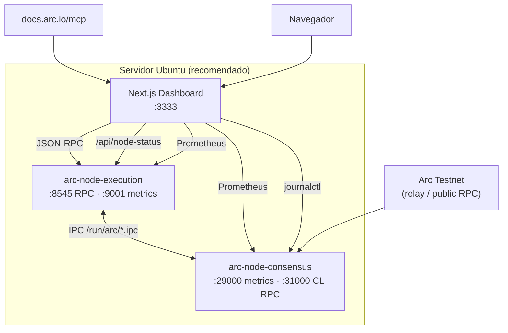

# Arc Node Runner Dashboard

> **Languages:** [English](README.md) · [한국어](README.ko.md) · [日本語](README.ja.md) · [简体中文](README.zh.md) · [Русский](README.ru.md) · [Español](README.es.md)

Panel web para operar un **nodo completo** de Arc Testnet y supervisar RPC, sincronización, métricas Prometheus y recursos del sistema en una sola vista.  
Se integra con el [MCP oficial de documentación Arc](https://docs.arc.io/ai/mcp) (`https://docs.arc.io/mcp`) para buscar documentación de operación del nodo con **Arc Docs Assistant**.

> Arquitectura del nodo: [Running a node](https://docs.arc.io/arc/concepts/running-a-node) · Instalación: [Run an Arc node](https://docs.arc.io/arc/tutorials/run-an-arc-node) · Requisitos: [Node requirements](https://docs.arc.io/arc/references/node-requirements)

---

## Funciones principales

| Área | Descripción |
|------|-------------|
| **Salud del nodo** | Sondeo de `eth_blockNumber`, `eth_chainId`, `eth_syncing`, `net_version` |
| **Estado EL / CL** | Execution (Reth) y Consensus (Malachite), systemd, IPC, métricas |
| **Sincronización** | Cabeza local vs red, progreso de sync |
| **Bloques / transacciones** | Bloques recientes y transacciones del último bloque (RPC on-chain) |
| **Prometheus** | EL `:9001`, CL `:29000` — proxy y gráficos |
| **Recursos** | CPU, memoria, disco `~/.arc` (panel y nodo en el **mismo host**) |
| **Logs en vivo** | `journalctl` — `arc-execution` / `arc-consensus` |
| **Arc Docs (MCP)** | `search_arc_docs` — búsqueda en documentación oficial |
| **Consola RPC** | Llamadas proxy a métodos JSON-RPC permitidos |

---

## Arquitectura



**Fuentes de datos**

- **Datos en vivo**: RPC, tablas de bloques/tx, sync, systemd/IPC/métricas/recursos OS (mismo host), logs journal, búsqueda MCP
- **Medidos / estimados**: intervalo de bloques, latencia RPC, progreso de cabeza

---

## Requisitos

### Solo panel (RPC público)

- **Node.js** `>= 18.18` ([Next.js 15](https://nextjs.org/))
- npm 9+

### Stack completo en Ubuntu (nodo + panel)

| Elemento | Recomendado |
|----------|-------------|
| SO | Ubuntu 22.04+ / Debian 12+ |
| CPU | Alta frecuencia (más importante que núcleos) |
| RAM | **64 GB+** |
| Disco | **1 TB+ NVMe** (snapshots y datos de cadena) |
| Red | 24 Mbps+ estable |

Binario del nodo Arc Testnet: **v0.6.0** ([arc-node](https://github.com/circlefin/arc-node))

---

## Inicio rápido

### 1) Clonar el repositorio

```bash
git clone https://github.com/mystar777/arc-node-runner-dashboard-repository.git
cd arc-node-runner-dashboard-repository
```

### 2) Variables de entorno

```bash
cp .env.example .env.local
# editar si hace falta
```

### 3) Instalar dependencias y ejecutar

```bash
npm install
npm run dev:local
```

Navegador: **http://127.0.0.1:3333**

> En `postinstall` se instalan hooks de Git que bloquean el trailer `Co-authored-by: Cursor`. Ver [Hooks de Git](#bloquear-cursor-co-authored-by-en-commits).

---

## Ubuntu: instalar nodo + panel (recomendado)

```bash
git clone https://github.com/mystar777/arc-node-runner-dashboard-repository.git
cd arc-node-runner-dashboard-repository
sudo bash scripts/install-arc-node.sh
```

### Qué hace el script

1. Instala herramientas de compilación y Rust  
2. Compila [arc-node](https://github.com/circlefin/arc-node) `v0.6.0` → `/usr/local/bin`  
3. Crea `~/.arc/execution`, `~/.arc/consensus`  
4. `arc-snapshots download --chain=arc-testnet` (**1–2 horas**, descarga grande)  
5. Registra e inicia servicios **systemd**  
   - `arc-execution` — RPC `127.0.0.1:8545`, métricas `:9001`  
   - `arc-consensus` — métricas `:29000`, CL RPC `:31000`  
6. `npm install` del panel y creación de `.env.local`  

### Opciones de instalación

```bash
sudo SKIP_SNAPSHOTS=1 bash scripts/install-arc-node.sh
sudo SKIP_BUILD=1 bash scripts/install-arc-node.sh
sudo DASHBOARD_INSTALL=0 bash scripts/install-arc-node.sh
```

### Verificar sincronización

```bash
sudo systemctl status arc-execution arc-consensus
journalctl -u arc-execution -f
cast block-number --rpc-url http://127.0.0.1:8545
```

---

## Ver el panel en un servidor remoto

Por defecto, `npm run dev:local` escucha solo en **`127.0.0.1:3333`**.  
No puedes abrir `http://YOUR_SERVER_IP:3333` directamente sin cambiar el bind.

### Opción A — Túnel SSH (recomendado)

```bash
ssh -L 3333:127.0.0.1:3333 ubuntu@YOUR_SERVER_IP
```

Navegador: **http://127.0.0.1:3333**

### Opción B — IP pública directa

```bash
npm run dev -- -H 0.0.0.0 -p 3333
sudo ufw allow 3333/tcp
```

Navegador: **http://YOUR_SERVER_IP:3333**

> Si se expone a internet, añade autenticación (proxy inverso, VPN, Basic Auth).

### Acceso remoto vs datos del nodo

| Dónde corre el panel | RPC y bloques | Métricas, disco, journal |
|----------------------|---------------|---------------------------|
| **Mismo Ubuntu que el nodo** | ✅ | ✅ |
| Otro PC, solo RPC público | ✅ | ❌ (aviso en la UI) |

Métricas, `journalctl` y disco son en vivo solo si **Next.js corre en la misma máquina que el nodo**.

---

## Variables de entorno

Copia `.env.example` a `.env.local`.

| Variable | Por defecto | Descripción |
|----------|-------------|-------------|
| `NEXT_PUBLIC_DEFAULT_RPC` | `http://127.0.0.1:8545` | RPC por defecto en el navegador |
| `NEXT_PUBLIC_NETWORK_RPC` | `https://rpc.testnet.arc.network` | Comparación con la red |
| `ARC_RPC_URL` | `http://127.0.0.1:8545` | `/api/node-status` en el servidor |
| `ARC_EXEC_METRICS_URL` | `http://127.0.0.1:9001/metrics` | Prometheus EL |
| `ARC_CONS_METRICS_URL` | `http://127.0.0.1:29000/metrics` | Prometheus CL |
| `ARC_DATA_DIR` | `/home/ubuntu/.arc` | Ruta de uso de disco |

---

## Scripts npm

| Comando | Descripción |
|---------|-------------|
| `npm run dev:local` | `127.0.0.1:3333` — local / túnel SSH |
| `npm run setup:hooks` | Hooks contra `Co-authored-by: Cursor` |
| `npm run commit:safe -- "mensaje"` | Commit seguro sin envoltorio de Cursor |

En Windows PowerShell, si falla la política de `npm.ps1`:

```powershell
npm.cmd run dev:local
.\dev-local.bat
```

---

## Arc Docs MCP

- Endpoint: `https://docs.arc.io/mcp`
- Herramientas: `search_arc_docs`, `query_docs_filesystem_arc_docs`
- Sin autenticación

---

## API

| Ruta | Método | Descripción |
|------|--------|-------------|
| `/api/rpc` | POST | Proxy JSON-RPC (URLs y métodos permitidos) |
| `/api/node-status` | GET | RPC, sync, systemd, métricas, recursos, alertas |
| `/api/arc-mcp` | POST | Búsqueda MCP de documentación Arc |
| `/api/logs` | GET | `journalctl` (Linux, mismo host) |

---

## Bloquear Cursor `Co-authored-by` en commits

- **Hooks globales**: `npm run setup:hooks`
- **Commit seguro**: `npm run commit:safe -- "mensaje"`

```bash
git log -1 --format=%B
```

---

## Referencia Arc Testnet

| Elemento | Valor |
|----------|-------|
| Chain ID | `5042002` |
| Gas | USDC |
| RPC público | `https://rpc.testnet.arc.network` |
| Explorer | [testnet.arcscan.app](https://testnet.arcscan.app/) |

| Puerto | Uso |
|--------|-----|
| 8545 | Execution JSON-RPC |
| 9001 | Execution Prometheus |
| 29000 | Consensus Prometheus |
| 31000 | Consensus RPC |

---

## Solución de problemas

- Se requiere Node **18.18+** (recomendado **20 LTS**).
- RPC `connection refused`: revisa `systemctl status arc-execution` y `http://127.0.0.1:8545`.
- Métricas/logs vacíos: ejecuta el panel en el **mismo Ubuntu que el nodo**.

---

## Licencia

Consulta [LICENSE](./LICENSE).

---

## Enlaces

- [Arc Network](https://docs.arc.io/arc-chain)
- [Integrate with Arc](https://docs.arc.io/integrate)
- [Arc MCP server](https://docs.arc.io/ai/mcp)
