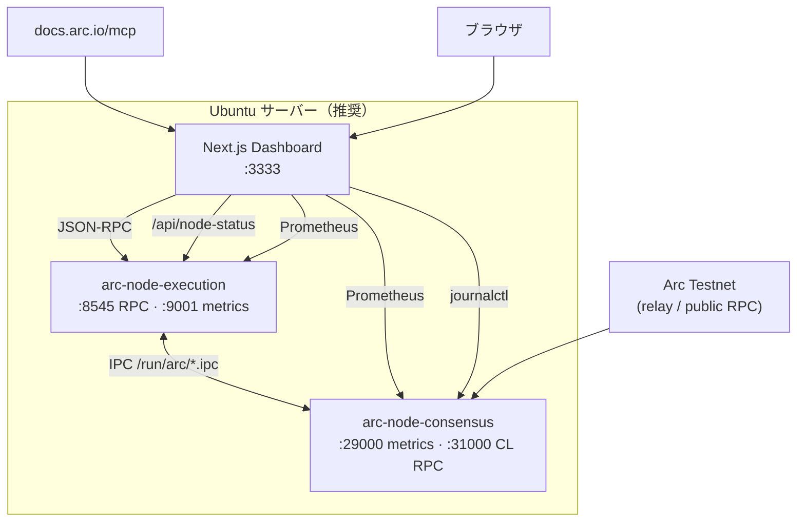

# Arc Node Runner Dashboard

> **Languages:** [English](README.md) · [한국어](README.ko.md) · [日本語](README.ja.md) · [简体中文](README.zh.md) · [Русский](README.ru.md) · [Español](README.es.md)

Arc Testnet の **フルノード** を運用しながら、RPC・同期・Prometheus メトリクス・システムリソースを一画面で監視する Web ダッシュボードです。  
[Arc 公式ドキュメント MCP](https://docs.arc.io/ai/mcp)（`https://docs.arc.io/mcp`）と連携し、**Arc Docs Assistant** でノード運用ドキュメントを検索できます。

> Arc ノード: [Running a node](https://docs.arc.io/arc/concepts/running-a-node) · インストール: [Run an Arc node](https://docs.arc.io/arc/tutorials/run-an-arc-node) · 要件: [Node requirements](https://docs.arc.io/arc/references/node-requirements)

---

## 主な機能

| 領域 | 内容 |
|------|------|
| **ノードヘルス** | `eth_blockNumber`, `eth_chainId`, `eth_syncing`, `net_version` のポーリング |
| **EL / CL 状態** | Execution (Reth)・Consensus (Malachite)、systemd・IPC・メトリクス |
| **同期** | ローカルヘッド vs ネットワークヘッド、同期進捗 |
| **ブロック / トランザクション** | 最近のブロック・最新ブロックのトランザクション（オンチェーン RPC） |
| **Prometheus** | EL `:9001`、CL `:29000` メトリクスのプロキシとチャート |
| **リソース** | CPU・メモリ・`~/.arc` ディスク使用量（ダッシュボードとノードが **同一ホスト**） |
| **ライブログ** | `journalctl` — `arc-execution` / `arc-consensus` |
| **Arc Docs (MCP)** | `search_arc_docs` — 公式ドキュメント検索 |
| **RPC コンソール** | 許可された JSON-RPC メソッドのプロキシ呼び出し |

---

## アーキテクチャ



**データソース**

- **実データ**: RPC、ブロック/トランザクション、sync、systemd・IPC・メトリクス・OS リソース（同一ホスト）、journal ログ、MCP 検索
- **測定/推定**: ブロック間隔（ファイナリティ）、RPC 遅延チャート、ヘッド進捗チャート

---

## 要件

### ダッシュボードのみ（公開 RPC）

- **Node.js** `>= 18.18`（[Next.js 15](https://nextjs.org/)）
- npm 9+

### Ubuntu フルスタック（ノード + ダッシュボード）

| 項目 | 推奨 |
|------|------|
| OS | Ubuntu 22.04+ / Debian 12+ |
| CPU | 高クロック（コア数より重要） |
| RAM | **64 GB 以上** |
| ディスク | **1 TB 以上 NVMe**（スナップショット・チェーンデータ） |
| ネットワーク | 安定した 24 Mbps 以上 |

Arc Testnet ノードバイナリ: **v0.6.0**（[arc-node](https://github.com/circlefin/arc-node)）

---

## クイックスタート

### 1) リポジトリのクローン

```bash
git clone https://github.com/mystar777/arc-node-runner-dashboard-repository.git
cd arc-node-runner-dashboard-repository
```

### 2) 環境変数

```bash
cp .env.example .env.local
# 必要に応じて編集
```

### 3) 依存関係のインストールと起動

```bash
npm install
npm run dev:local
```

ブラウザ: **http://127.0.0.1:3333**

> `postinstall` で Git フックがインストールされ、Cursor の `Co-authored-by` トレーラーをブロックします（[Git フック](#コミット時の-cursor-co-authored-by-ブロック)）。

---

## Ubuntu: ノード + ダッシュボード一括インストール（推奨）

公式チュートリアルに基づく自動インストールスクリプトです。

```bash
git clone https://github.com/mystar777/arc-node-runner-dashboard-repository.git
cd arc-node-runner-dashboard-repository
sudo bash scripts/install-arc-node.sh
```

### スクリプトの処理

1. ビルドツール・Rust のインストール  
2. [arc-node](https://github.com/circlefin/arc-node) `v0.6.0` のビルド → `/usr/local/bin`  
3. `~/.arc/execution`, `~/.arc/consensus` の作成  
4. `arc-snapshots download --chain=arc-testnet`（**1〜2 時間**、大容量）  
5. **systemd** サービスの登録・起動  
   - `arc-execution` — RPC `127.0.0.1:8545`、metrics `:9001`  
   - `arc-consensus` — metrics `:29000`、CL RPC `:31000`  
6. ダッシュボードの `npm install` と `.env.local` の作成  

### インストールオプション（環境変数）

```bash
sudo SKIP_SNAPSHOTS=1 bash scripts/install-arc-node.sh   # スナップショット省略
sudo SKIP_BUILD=1 bash scripts/install-arc-node.sh       # ビルド済みの場合
sudo DASHBOARD_INSTALL=0 bash scripts/install-arc-node.sh # ダッシュボードのみ省略
```

### 同期の確認

```bash
sudo systemctl status arc-execution arc-consensus
journalctl -u arc-execution -f
cast block-number --rpc-url http://127.0.0.1:8545
```

### ダッシュボードの起動（インストール後）

```bash
cd arc-node-runner-dashboard-repository
npm run dev:local
```

---

## リモートサーバーからダッシュボードを表示

デフォルトの `npm run dev:local` は **`127.0.0.1:3333`** のみにバインドされます。  
サーバー IP `YOUR_SERVER_IP:3333` には **直接アクセスできません**。

### 方法 A — SSH トンネル（推奨）

```bash
ssh -L 3333:127.0.0.1:3333 ubuntu@YOUR_SERVER_IP
```

ブラウザ: **http://127.0.0.1:3333**

### 方法 B — 外部 IP で直接アクセス

```bash
npm run dev -- -H 0.0.0.0 -p 3333
sudo ufw allow 3333/tcp
```

ブラウザ: **http://YOUR_SERVER_IP:3333**

> 公開インターネットに出す場合は認証（リバースプロキシ、VPN 等）を検討してください。

### リモートアクセスとノードデータ

| ダッシュボードの実行場所 | RPC・ブロック | メトリクス・ディスク・journal |
|--------------------------|---------------|------------------------------|
| **ノードと同じ Ubuntu** | ✅ | ✅ |
| 別 PC + 公開 RPC のみ | ✅ | ❌（UI に警告） |

メトリクス・`journalctl`・ディスクは **Next.js がノードと同じマシン** で動作するときのみ実データです。

---

## 環境変数

`.env.example` を `.env.local` にコピーします。

| 変数 | デフォルト | 説明 |
|------|------------|------|
| `NEXT_PUBLIC_DEFAULT_RPC` | `http://127.0.0.1:8545` | ブラウザのデフォルト RPC |
| `NEXT_PUBLIC_NETWORK_RPC` | `https://rpc.testnet.arc.network` | ネットワークヘッド比較 |
| `ARC_RPC_URL` | `http://127.0.0.1:8545` | サーバー `/api/node-status` |
| `ARC_EXEC_METRICS_URL` | `http://127.0.0.1:9001/metrics` | EL Prometheus |
| `ARC_CONS_METRICS_URL` | `http://127.0.0.1:29000/metrics` | CL Prometheus |
| `ARC_DATA_DIR` | `/home/ubuntu/.arc` | ディスク使用量のパス |

---

## npm スクリプト

| コマンド | 説明 |
|--------|------|
| `npm run dev:local` | `127.0.0.1:3333` — ローカル / SSH トンネル |
| `npm run setup:hooks` | `Co-authored-by: Cursor` ブロック用 Git フック |
| `npm run commit:safe -- "メッセージ"` | Cursor ラッパーなしの安全なコミット |

---

## Arc Docs MCP

- エンドポイント: `https://docs.arc.io/mcp`
- ツール: `search_arc_docs`, `query_docs_filesystem_arc_docs`
- 認証不要

---

## API

| パス | メソッド | 説明 |
|------|----------|------|
| `/api/rpc` | POST | JSON-RPC プロキシ |
| `/api/node-status` | GET | RPC・sync・systemd・メトリクス・リソース |
| `/api/arc-mcp` | POST | Arc ドキュメント MCP 検索 |
| `/api/logs` | GET | `journalctl`（Linux、同一ホスト） |

---

## コミット時の Cursor `Co-authored-by` ブロック

- **グローバルフック**: `npm run setup:hooks`
- **安全なコミット**: `npm run commit:safe -- "メッセージ"`

```bash
git log -1 --format=%B
```

---

## Arc Testnet 参考

| 項目 | 値 |
|------|-----|
| Chain ID | `5042002` |
| 公開 RPC | `https://rpc.testnet.arc.network` |
| Explorer | [testnet.arcscan.app](https://testnet.arcscan.app/) |

| ポート | 用途 |
|--------|------|
| 8545 | Execution JSON-RPC |
| 9001 | Execution Prometheus |
| 29000 | Consensus Prometheus |
| 31000 | Consensus RPC |

---

## トラブルシューティング

- Node **18.18+**（推奨 **20 LTS**）が必要です。
- RPC `connection refused`: `systemctl status arc-execution`、URL `http://127.0.0.1:8545` を確認。
- メトリクス・ログが空: ダッシュボードを **ノードと同じ Ubuntu** で実行してください。

---

## ライセンス

[LICENSE](./LICENSE) を参照してください。

---

## リンク

- [Arc Network](https://docs.arc.io/arc-chain)
- [Integrate with Arc](https://docs.arc.io/integrate)
- [Arc MCP server](https://docs.arc.io/ai/mcp)
