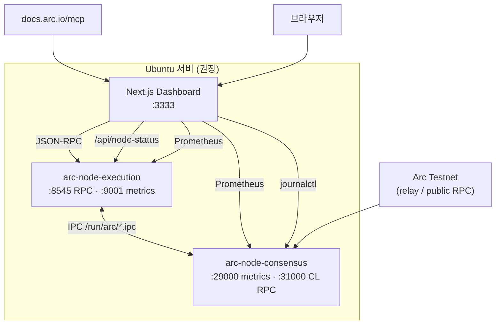

# Arc Node Runner Dashboard

> **Languages:** [English](README.md) · [한국어](README.ko.md) · [日本語](README.ja.md) · [简体中文](README.zh.md) · [Русский](README.ru.md) · [Español](README.es.md)

Arc Testnet **풀 노드**를 운영하면서 RPC·동기화·Prometheus 메트릭·시스템 리소스를 한 화면에서 모니터링하는 웹 대시보드입니다.  
[Arc 공식 문서 MCP](https://docs.arc.io/ai/mcp)(`https://docs.arc.io/mcp`)와 연동해 **Arc Docs Assistant**로 노드 운영 문서를 검색할 수 있습니다.

> Arc 노드 아키텍처: [Running a node](https://docs.arc.io/arc/concepts/running-a-node) · 설치: [Run an Arc node](https://docs.arc.io/arc/tutorials/run-an-arc-node) · 요구 사항: [Node requirements](https://docs.arc.io/arc/references/node-requirements)

---

## 주요 기능

| 영역 | 내용 |
|------|------|
| **노드 헬스** | `eth_blockNumber`, `eth_chainId`, `eth_syncing`, `net_version` 폴링 |
| **EL / CL 상태** | Execution( Reth )·Consensus( Malachite ) 헬스, systemd·IPC·메트릭 연동 |
| **동기화** | 로컬 헤드 vs 네트워크 헤드, sync 진행률 |
| **블록 / 트랜잭션** | 최근 블록·최신 블록 트랜잭션 (온체인 RPC) |
| **Prometheus** | EL `:9001`, CL `:29000` 메트릭 프록시·차트 |
| **리소스** | CPU·메모리·`~/.arc` 디스크 사용량 (대시보드와 노드 **동일 호스트**) |
| **Live Logs** | `journalctl` — `arc-execution` / `arc-consensus` |
| **Arc Docs (MCP)** | `search_arc_docs` — 공식 문서 검색 |
| **RPC 콘솔** | 허용된 JSON-RPC 메서드 프록시 호출 |
| **UI 언어** | English, 한국어, 日本語, 简体中文, Русский, Español (상단 선택, 브라우저 저장) |

---

## 아키텍처



**데이터 출처 요약**

- **실데이터**: RPC, 블록/트랜잭션 테이블, sync, systemd·IPC·메트릭·OS 리소스(동일 호스트), journal 로그, MCP 문서 검색
- **측정/추정**: 블록 간격(finality), RPC 지연 차트, 헤드 진행 차트

---

## 요구 사항

### 대시보드만 (공개 RPC 연결)

- **Node.js** `>= 18.18` ([Next.js 15](https://nextjs.org/) 요구)
- npm 9+

### Ubuntu 풀 스택 (노드 + 대시보드)

| 항목 | 권장 |
|------|------|
| OS | Ubuntu 22.04+ / Debian 12+ |
| CPU | 높은 클럭 (코어 수보다 중요) |
| RAM | **64 GB+** |
| 디스크 | **1 TB+ NVMe** (스냅샷·체인 데이터) |
| 네트워크 | 안정적인 24 Mbps+ |

Arc Testnet 노드 바이너리: **v0.6.0** ([arc-node](https://github.com/circlefin/arc-node))

---

## 빠른 시작

### 1) 저장소 클론

```bash
git clone https://github.com/mystar777/arc-node-runner-dashboard-repository.git
cd arc-node-runner-dashboard-repository
```

### 2) 환경 변수

```bash
cp .env.example .env.local
# 필요 시 편집 — 아래 환경 변수 참고
```

> **Windows / 대시보드만 (로컬 노드 없음):** 기본값은 `http://127.0.0.1:8545`입니다. 같은 PC에서 Arc 노드가 떠 있지 않으면 `/api/rpc`가 **502**를 반환합니다. `.env.local`에 **공개 Testnet RPC**를 설정한 뒤 개발 서버를 **재시작**하세요.

### 3) 의존성 설치 및 실행

```bash
npm install
npm run dev:local
```

브라우저: **http://127.0.0.1:3333**

> `postinstall` 시 Git 훅이 전역·로컬에 설치되어 Cursor `Co-authored-by` 트레일러를 차단합니다. ([Git 훅](#git-커밋-cursor-co-authored-by-차단) 참고)

---

## Ubuntu: 노드 + 대시보드 한 번에 설치 (권장)

공식 튜토리얼을 바탕으로 한 자동 설치 스크립트입니다.

```bash
git clone https://github.com/mystar777/arc-node-runner-dashboard-repository.git
cd arc-node-runner-dashboard-repository
sudo bash scripts/install-arc-node.sh
```

### 스크립트가 하는 일

1. 빌드 도구·Rust 설치  
2. [arc-node](https://github.com/circlefin/arc-node) `v0.6.0` 빌드 → `/usr/local/bin`  
3. `~/.arc/execution`, `~/.arc/consensus` 생성  
4. `arc-snapshots download --chain=arc-testnet` (스냅샷, **1~2시간·대용량**)  
5. **systemd** 서비스 등록·기동  
   - `arc-execution` — RPC `127.0.0.1:8545`, metrics `:9001`  
   - `arc-consensus` — metrics `:29000`, CL RPC `:31000`  
6. 대시보드 `npm install` + `.env.local` 생성  

### 설치 옵션 (환경 변수)

```bash
# 스냅샷 생략 (동기화 매우 오래 걸림)
sudo SKIP_SNAPSHOTS=1 bash scripts/install-arc-node.sh

# 이미 빌드된 바이너리가 있을 때
sudo SKIP_BUILD=1 bash scripts/install-arc-node.sh

# 대시보드 설치만 생략
sudo DASHBOARD_INSTALL=0 bash scripts/install-arc-node.sh
```

### 동기화 확인

```bash
sudo systemctl status arc-execution arc-consensus
journalctl -u arc-execution -f

# Foundry cast (선택)
cast block-number --rpc-url http://127.0.0.1:8545
```

### 대시보드 기동 (설치 후)

```bash
cd arc-node-runner-dashboard-repository
npm run dev:local
```

---

## 원격 서버에서 대시보드 보기

기본 `npm run dev:local`은 **`127.0.0.1:3333`** 에만 바인딩됩니다.  
즉, 서버 IP `111.222.333.444:3333`으로 **바로 접속되지 않습니다**.

### 방법 A — SSH 터널 (권장, 보안)

서버에서는 로컬만 열고, 내 PC에서:

```bash
ssh -L 3333:127.0.0.1:3333 ubuntu@111.222.333.444
```

브라우저: **http://127.0.0.1:3333**

### 방법 B — 외부 IP로 직접 접속

```bash
npm run dev -- -H 0.0.0.0 -p 3333
# 프로덕션: npm run build && npm start -- -H 0.0.0.0 -p 3333
```

방화벽·보안 그룹에서 **3333/TCP** 허용:

```bash
sudo ufw allow 3333/tcp
```

브라우저: **http://111.222.333.444:3333**

> 공개 인터넷에 노출 시 인증(리버스 프록시, VPN, Basic Auth)을 반드시 고려하세요.

### 방법 C — 프로덕션 HTTPS (Nginx + Let's Encrypt) **공개 접속 권장**

Ubuntu에서 앱 빌드 → `systemd`로 `127.0.0.1:3333` 실행 → **Nginx**가 **80/443**에서 HTTPS 종료 → **Let's Encrypt** 인증서(공인 IP 또는 도메인).

```bash
cd arc-node-runner-dashboard-repository
# .env.local 편집 후

sudo PUBLIC_HOST=203.0.113.10 \
     LE_EMAIL=you@example.com \
     bash scripts/setup-dashboard-https.sh
```

접속: **https://203.0.113.10/** (실제 공인 IP 또는 DNS 이름 사용).

| 변수 | 필수 | 설명 |
|------|------|------|
| `PUBLIC_HOST` | 예 | 공인 **IP** 또는 이 서버를 가리키는 **도메인** |
| `LE_EMAIL` | 예 | Let's Encrypt 등록 이메일 |
| `ENABLE_BASIC_AUTH` | 아니오 | `1`이면 Nginx HTTP Basic Auth |
| `SKIP_BUILD` / `SKIP_CERTBOT` | 아니오 | 빌드·인증서 단계 건너뛰기 |

**조건:** TCP **80·443** 개방, [Let's Encrypt IP 인증서](https://letsencrypt.org/docs/ip-addresses/)는 유효기간 **약 6일**(자동 갱신). 장기 운영은 **도메인** 권장.

**설치 후:** `sudo systemctl status arc-dashboard nginx` · `sudo certbot renew --dry-run`

배포 파일: `deploy/arc-dashboard.service`, `deploy/nginx/arc-dashboard.conf.template`, `scripts/setup-dashboard-https.sh`.

### 원격 접속 vs 노드 데이터

| 대시보드 실행 위치 | RPC·블록 | 메트릭·디스크·journal |
|-------------------|----------|----------------------|
| **노드와 같은 Ubuntu** | ✅ | ✅ |
| 다른 PC + 공개 RPC만 | ✅ | ❌ (UI에 경고 표시) |

메트릭(`9001`/`29000`)·`journalctl`·디스크는 **Next.js가 노드와 같은 머신**에서 실행될 때만 실데이터입니다.

---

## 환경 변수

`.env.example`을 복사해 `.env.local`을 만듭니다.

| 변수 | 기본값 | 설명 |
|------|--------|------|
| `NEXT_PUBLIC_DEFAULT_RPC` | `http://127.0.0.1:8545` | 브라우저 기본 RPC |
| `NEXT_PUBLIC_NETWORK_RPC` | `https://rpc.testnet.arc.network` | 네트워크 헤드 비교용 |
| `ARC_RPC_URL` | `http://127.0.0.1:8545` | 서버 `/api/node-status` |
| `ARC_NETWORK_RPC_URL` | 공개 testnet RPC | 네트워크 블록 참조 |
| `ARC_EXEC_METRICS_URL` | `http://127.0.0.1:9001/metrics` | EL Prometheus |
| `ARC_CONS_METRICS_URL` | `http://127.0.0.1:29000/metrics` | CL Prometheus |
| `ARC_DATA_DIR` | `/home/ubuntu/.arc` | 디스크 사용량 경로 |

**대시보드만** (로컬 노드 없음 — Windows·macOS 등):

```env
NEXT_PUBLIC_DEFAULT_RPC=https://rpc.testnet.arc.network
NEXT_PUBLIC_NETWORK_RPC=https://rpc.testnet.arc.network
ARC_RPC_URL=https://rpc.testnet.arc.network
ARC_NETWORK_RPC_URL=https://rpc.testnet.arc.network
```

`.env.local` 변경 후 `npm run dev:local`을 **다시 실행**하세요. UI **Settings**에서 RPC URL을 바꿀 수도 있습니다 (`localStorage`).

공식 Testnet RPC ([RPC endpoints](https://docs.arc.io/arc/references/rpc-endpoints)): `https://rpc.testnet.arc.network`

---

## npm 스크립트

| 명령 | 설명 |
|------|------|
| `npm run dev` | 개발 서버 (기본 `0.0.0.0:3000`) |
| `npm run dev:local` | `127.0.0.1:3333` — 로컬·SSH 터널용 |
| `npm run build` | 프로덕션 빌드 |
| `npm run start` | 프로덕션 서버 (기본 3000) |
| `npm run start:prod` | `127.0.0.1:3333` (Nginx 역프록시용) |
| `npm run setup:hooks` | Git `Co-authored-by: Cursor` 차단 훅 설치 |
| `npm run commit:safe -- "메시지"` | Cursor 래핑 없이 안전 커밋 |

Windows PowerShell에서 `npm` 실행 정책 오류 시:

```powershell
npm.cmd run dev:local
# 또는
.\dev-local.bat
```

---

## Arc Docs MCP

대시보드 **Arc Docs Assistant** 탭은 서버가 [Arc MCP](https://docs.arc.io/ai/mcp)에 연결합니다.

- 엔드포인트: `https://docs.arc.io/mcp`
- 도구: `search_arc_docs`, `query_docs_filesystem_arc_docs`
- 인증 불필요

Cursor IDE에서 동일 MCP를 쓰려면 [Arc MCP 문서](https://docs.arc.io/ai/mcp)의 `mcp.json` 예시를 참고하세요.

```json
{
  "mcpServers": {
    "arc-docs": {
      "url": "https://docs.arc.io/mcp"
    }
  }
}
```

---

## API (대시보드 내부)

| 경로 | 메서드 | 설명 |
|------|--------|------|
| `/api/rpc` | POST | JSON-RPC 프록시 (허용 URL·메서드만) |
| `/api/node-status` | GET | RPC·sync·systemd·메트릭·리소스·알림 집계 |
| `/api/arc-mcp` | POST | Arc 문서 MCP 검색 |
| `/api/logs` | GET | `journalctl` (Linux, 동일 호스트) |

### RPC 프록시 허용 URL

- `http://127.0.0.1:*`, `http://localhost:*`
- `https://*.arc.network`

### RPC 허용 메서드 (일부)

`eth_blockNumber`, `eth_chainId`, `eth_syncing`, `eth_getBlockByNumber`, `eth_gasPrice`, `web3_clientVersion` 등 — `app/api/rpc/route.ts` 참고.

### `/api/rpc` 오류 (502)

요청 본문의 URL로 JSON-RPC를 **프록시**합니다. **502**는 Next.js 라우트 오류가 아니라, **해당 RPC에 연결하지 못했다**는 뜻입니다.

| `code` | 흔한 원인 |
|--------|-----------|
| `connection_refused` | URL에 RPC 서버 없음 (예: 로컬 8545에 노드 미기동) |
| `timeout` | 25초 내 응답 없음 |
| `http` | 업스트림 HTTP 오류 |

응답 JSON에 `error`, `hint`, `rpcUrl`이 포함됩니다. 구현: `lib/rpcFetchError.ts`.

---

## 프로젝트 구조

```
├── app/
│   ├── api/              # RPC, node-status, logs, arc-mcp
│   ├── layout.tsx
│   └── page.tsx
├── components/
│   └── arc-dashboard/    # 대시보드 UI, charts, i18n.ts
├── lib/                  # RPC, Prometheus, URL allowlist, rpcFetchError
├── deploy/
│   ├── arc-dashboard.service
│   └── nginx/arc-dashboard.conf.template
├── scripts/
│   ├── install-arc-node.sh
│   ├── setup-dashboard-https.sh   # Nginx + Let's Encrypt HTTPS
│   ├── install-git-hooks.mjs
│   ├── git-commit-safe.mjs
│   └── ensure-node.mjs
├── .githooks/            # Co-authored-by 차단
├── .env.example
└── dev-local.bat         # Windows용 dev:local
```

---

## Git 커밋: Cursor `Co-authored-by` 차단

Cursor 터미널이 커밋에 `Co-authored-by: Cursor <cursoragent@cursor.com>`를 붙이는 경우가 있습니다.

- **전역 훅**: `~/.githooks-global` (`npm run setup:hooks` / `postinstall`)
- **안전 커밋**: `npm run commit:safe -- "메시지"`

푸시 전 확인:

```bash
git log -1 --format=%B
```

---

## Arc Testnet 참고

| 항목 | 값 |
|------|-----|
| Chain ID | `5042002` |
| Gas | USDC |
| 공개 RPC | `https://rpc.testnet.arc.network` |
| Explorer | [testnet.arcscan.app](https://testnet.arcscan.app/) |
| Faucet | [faucet.circle.com](https://faucet.circle.com/) |

노드 포트 ([Node requirements](https://docs.arc.io/arc/references/node-requirements)):

| 포트 | 용도 |
|------|------|
| 8545 | Execution JSON-RPC |
| 9001 | Execution Prometheus |
| 29000 | Consensus Prometheus |
| 31000 | Consensus RPC |

---

## 문제 해결

### `You are using Node.js 16.x` / Next.js 버전 오류

Node **18.18+** (권장 **20 LTS**) 설치 후 재시도.

```bash
node -v   # v20.x 권장
```

### PowerShell `npm.ps1` 실행 정책 오류

```powershell
npm.cmd run dev:local
```

### `/api/rpc` **502** 또는 `fetch failed`

1. 브라우저 개발자 도구 → 실패한 요청 → **Response**에서 `code`, `hint` 확인.
2. `connection_refused`이고 URL이 `http://127.0.0.1:8545`이면 이 PC에 노드가 없습니다. [환경 변수](#환경-변수)대로 공개 RPC를 `.env.local`에 넣고 서버를 재시작하세요.
3. 프록시 테스트:

```bash
curl -s -X POST http://127.0.0.1:3333/api/rpc \
  -H "Content-Type: application/json" \
  -d '{"url":"https://rpc.testnet.arc.network","method":"eth_blockNumber"}'
```

`"ok":true`이면 대시보드-only 설정이 맞습니다.

### RPC `connection refused` (로컬 노드)

- 노드 기동 여부: `systemctl status arc-execution`
- URL: `http://127.0.0.1:8545` (대시보드와 **같은 서버**)
- 방화벽에서 8545를 외부에 열지 않았는지 확인 (기본은 로컬만)
- Testnet RPC 목록: [RPC endpoints](https://docs.arc.io/arc/references/rpc-endpoints)

### 메트릭·로그·디스크가 비어 있음

대시보드를 **노드와 같은 Ubuntu**에서 실행했는지 확인. Windows에서 공개 RPC만 쓰면 RPC·블록만 실데이터입니다.

### 스냅샷 다운로드가 오래 걸림

정상입니다(수십 GB, 1~2시간). `SKIP_SNAPSHOTS=1`은 초기 동기화만 극단적으로 길어집니다.

### Chain ID 불일치

`.env`와 노드가 **Arc Testnet**(`5042002`)인지 확인. [Run an Arc node](https://docs.arc.io/arc/tutorials/run-an-arc-node) 제네시스·`--chain arc-testnet` 확인.

### Let's Encrypt / HTTPS 실패

- **80번 포트**가 인터넷에서 이 서버로 열려 있는지 확인.
- `PUBLIC_HOST`는 **공인 IP/도메인**이어야 함 (`127.0.0.1` 아님).
- IP 전용 인증서: [Let's Encrypt IP 안내](https://letsencrypt.org/docs/ip-addresses/) (~6일, 자동 갱신 필요).

---

## 라이선스

이 저장소의 라이선스는 [LICENSE](./LICENSE) 파일을 참고하세요.

Arc 네트워크·`arc-node` 바이너리는 Circle / Arc 프로젝트 약관 및 해당 저장소 라이선스를 따릅니다.

---

## 링크

- [Arc Network](https://docs.arc.io/arc-chain)
- [Integrate with Arc](https://docs.arc.io/integrate)
- [Arc MCP server](https://docs.arc.io/ai/mcp)
- [RPC endpoints (Testnet)](https://docs.arc.io/arc/references/rpc-endpoints)
- [Deploy node as systemd service](https://docs.arc.io/arc/tutorials/deploy-node-as-service)
- [Monitor a node](https://docs.arc.io/arc/tutorials/monitor-a-node)
