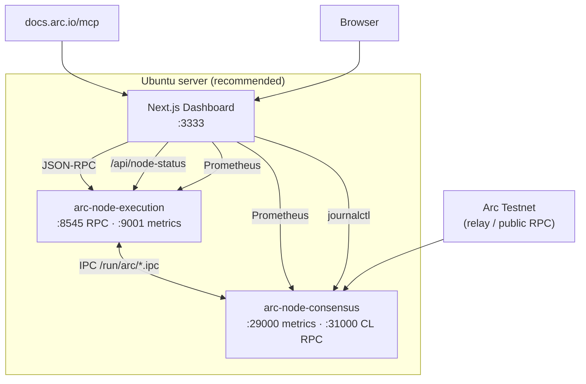

# Arc Node Runner Dashboard

> **Languages:** [English](README.md) · [한국어](README.ko.md) · [日本語](README.ja.md) · [简体中文](README.zh.md) · [Русский](README.ru.md) · [Español](README.es.md)

A web dashboard for operating an Arc Testnet **full node** and monitoring RPC, sync status, Prometheus metrics, and system resources in one place.  
It integrates with the [official Arc Docs MCP](https://docs.arc.io/ai/mcp) (`https://docs.arc.io/mcp`) so you can search node operations docs via **Arc Docs Assistant**.

> Arc node architecture: [Running a node](https://docs.arc.io/arc/concepts/running-a-node) · Install: [Run an Arc node](https://docs.arc.io/arc/tutorials/run-an-arc-node) · Requirements: [Node requirements](https://docs.arc.io/arc/references/node-requirements)

---

## Features

| Area | Description |
|------|-------------|
| **Node health** | Poll `eth_blockNumber`, `eth_chainId`, `eth_syncing`, `net_version` |
| **EL / CL status** | Execution (Reth) & Consensus (Malachite) health, systemd, IPC, metrics |
| **Sync** | Local head vs network head, sync progress |
| **Blocks / txs** | Recent blocks and latest-block transactions (on-chain RPC) |
| **Prometheus** | EL `:9001`, CL `:29000` metrics proxy & charts |
| **Resources** | CPU, memory, `~/.arc` disk usage (dashboard and node on **same host**) |
| **Live logs** | `journalctl` — `arc-execution` / `arc-consensus` |
| **Arc Docs (MCP)** | `search_arc_docs` — official documentation search |
| **RPC console** | Proxy calls for allowed JSON-RPC methods |

---

## Architecture



**Data sources**

- **Live data**: RPC, block/tx tables, sync, systemd/IPC/metrics/OS resources (same host), journal logs, MCP doc search
- **Measured / estimated**: block interval (finality), RPC latency charts, head progress charts

---

## Requirements

### Dashboard only (public RPC)

- **Node.js** `>= 18.18` ([Next.js 15](https://nextjs.org/))
- npm 9+

### Full Ubuntu stack (node + dashboard)

| Item | Recommended |
|------|-------------|
| OS | Ubuntu 22.04+ / Debian 12+ |
| CPU | High clock speed (more important than core count) |
| RAM | **64 GB+** |
| Disk | **1 TB+ NVMe** (snapshots & chain data) |
| Network | Stable 24 Mbps+ |

Arc Testnet node binary: **v0.6.0** ([arc-node](https://github.com/circlefin/arc-node))

---

## Quick start

### 1) Clone the repository

```bash
git clone https://github.com/mystar777/arc-node-runner-dashboard-repository.git
cd arc-node-runner-dashboard-repository
```

### 2) Environment variables

```bash
cp .env.example .env.local
# edit as needed
```

### 3) Install dependencies and run

```bash
npm install
npm run dev:local
```

Open in browser: **http://127.0.0.1:3333**

> On `postinstall`, Git hooks are installed globally and locally to block Cursor `Co-authored-by` trailers. See [Git hooks](#block-cursor-co-authored-by-on-commits).

---

## Ubuntu: install node + dashboard (recommended)

Automated installer based on the official tutorial.

```bash
git clone https://github.com/mystar777/arc-node-runner-dashboard-repository.git
cd arc-node-runner-dashboard-repository
sudo bash scripts/install-arc-node.sh
```

### What the script does

1. Installs build tools and Rust  
2. Builds [arc-node](https://github.com/circlefin/arc-node) `v0.6.0` → `/usr/local/bin`  
3. Creates `~/.arc/execution`, `~/.arc/consensus`  
4. Runs `arc-snapshots download --chain=arc-testnet` (**1–2 hours**, large download)  
5. Registers and starts **systemd** services  
   - `arc-execution` — RPC `127.0.0.1:8545`, metrics `:9001`  
   - `arc-consensus` — metrics `:29000`, CL RPC `:31000`  
6. Runs dashboard `npm install` and creates `.env.local`  

### Install options (environment variables)

```bash
# Skip snapshot (sync takes much longer)
sudo SKIP_SNAPSHOTS=1 bash scripts/install-arc-node.sh

# When binaries are already built
sudo SKIP_BUILD=1 bash scripts/install-arc-node.sh

# Skip dashboard install only
sudo DASHBOARD_INSTALL=0 bash scripts/install-arc-node.sh
```

### Verify sync

```bash
sudo systemctl status arc-execution arc-consensus
journalctl -u arc-execution -f

# Foundry cast (optional)
cast block-number --rpc-url http://127.0.0.1:8545
```

### Start the dashboard (after install)

```bash
cd arc-node-runner-dashboard-repository
npm run dev:local
```

---

## Viewing the dashboard on a remote server

By default, `npm run dev:local` binds to **`127.0.0.1:3333` only**.  
You **cannot** open `http://111.222.333.444:3333` directly unless you change the bind address.

### Option A — SSH tunnel (recommended, secure)

Keep the server on localhost only; on your PC:

```bash
ssh -L 3333:127.0.0.1:3333 ubuntu@111.222.333.444
```

Browser: **http://127.0.0.1:3333**

### Option B — Direct access via public IP

```bash
npm run dev -- -H 0.0.0.0 -p 3333
# production: npm run build && npm start -- -H 0.0.0.0 -p 3333
```

Allow **3333/TCP** in firewall / security group:

```bash
sudo ufw allow 3333/tcp
```

Browser: **http://111.222.333.444:3333**

> If exposed on the public internet, add authentication (reverse proxy, VPN, Basic Auth).

### Option C — Production

```bash
npm run build
npm start -- -H 0.0.0.0 -p 3333
```

Use Nginx + HTTPS + auth in front.

### Remote access vs node data

| Where the dashboard runs | RPC & blocks | Metrics, disk, journal |
|--------------------------|--------------|-------------------------|
| **Same Ubuntu as the node** | ✅ | ✅ |
| Other PC, public RPC only | ✅ | ❌ (warning in UI) |

Metrics (`9001`/`29000`), `journalctl`, and disk usage are live only when **Next.js runs on the same machine as the node**.

---

## Environment variables

Copy `.env.example` to `.env.local`.

| Variable | Default | Description |
|----------|---------|-------------|
| `NEXT_PUBLIC_DEFAULT_RPC` | `http://127.0.0.1:8545` | Browser default RPC |
| `NEXT_PUBLIC_NETWORK_RPC` | `https://rpc.testnet.arc.network` | Network head comparison |
| `ARC_RPC_URL` | `http://127.0.0.1:8545` | Server `/api/node-status` |
| `ARC_NETWORK_RPC_URL` | public testnet RPC | Network block reference |
| `ARC_EXEC_METRICS_URL` | `http://127.0.0.1:9001/metrics` | EL Prometheus |
| `ARC_CONS_METRICS_URL` | `http://127.0.0.1:29000/metrics` | CL Prometheus |
| `ARC_DATA_DIR` | `/home/ubuntu/.arc` | Disk usage path |

Example using public RPC only:

```env
NEXT_PUBLIC_DEFAULT_RPC=https://rpc.testnet.arc.network
NEXT_PUBLIC_NETWORK_RPC=https://rpc.testnet.arc.network
```

---

## npm scripts

| Command | Description |
|---------|-------------|
| `npm run dev` | Dev server (default `0.0.0.0:3000`) |
| `npm run dev:local` | `127.0.0.1:3333` — local / SSH tunnel |
| `npm run build` | Production build |
| `npm run start` | Production server |
| `npm run setup:hooks` | Install Git hooks blocking `Co-authored-by: Cursor` |
| `npm run commit:safe -- "message"` | Commit without Cursor wrapper |

On Windows PowerShell, if `npm.ps1` execution policy fails:

```powershell
npm.cmd run dev:local
# or
.\dev-local.bat
```

---

## Arc Docs MCP

The dashboard **Arc Docs Assistant** tab connects to [Arc MCP](https://docs.arc.io/ai/mcp).

- Endpoint: `https://docs.arc.io/mcp`
- Tools: `search_arc_docs`, `query_docs_filesystem_arc_docs`
- No authentication required

For Cursor IDE, see the `mcp.json` example in [Arc MCP docs](https://docs.arc.io/ai/mcp).

```json
{
  "mcpServers": {
    "arc-docs": {
      "url": "https://docs.arc.io/mcp"
    }
  }
}
```

---

## API (dashboard)

| Path | Method | Description |
|------|--------|-------------|
| `/api/rpc` | POST | JSON-RPC proxy (allowed URLs & methods only) |
| `/api/node-status` | GET | RPC, sync, systemd, metrics, resources, alerts |
| `/api/arc-mcp` | POST | Arc docs MCP search |
| `/api/logs` | GET | `journalctl` (Linux, same host) |

### RPC proxy allowed URLs

- `http://127.0.0.1:*`, `http://localhost:*`
- `https://*.arc.network`

### Allowed RPC methods (partial)

`eth_blockNumber`, `eth_chainId`, `eth_syncing`, `eth_getBlockByNumber`, `eth_gasPrice`, `web3_clientVersion`, etc. — see `app/api/rpc/route.ts`.

---

## Project structure

```
├── app/
│   ├── api/              # RPC, node-status, logs, arc-mcp
│   ├── layout.tsx
│   └── page.tsx
├── components/
│   └── arc-dashboard/    # Dashboard UI
├── lib/                  # RPC, Prometheus, URL allowlist
├── scripts/
│   ├── install-arc-node.sh   # Ubuntu node installer
│   ├── install-git-hooks.mjs
│   ├── git-commit-safe.mjs
│   └── ensure-node.mjs
├── .githooks/            # Block Co-authored-by
├── .env.example
└── dev-local.bat         # Windows dev:local
```

---

## Block Cursor `Co-authored-by` on commits

The Cursor terminal may append `Co-authored-by: Cursor <cursoragent@cursor.com>` to commits.

- **Global hooks**: `~/.githooks-global` (`npm run setup:hooks` / `postinstall`)
- **Safe commit**: `npm run commit:safe -- "message"`

Before push:

```bash
git log -1 --format=%B
```

---

## Arc Testnet reference

| Item | Value |
|------|-------|
| Chain ID | `5042002` |
| Gas token | USDC |
| Public RPC | `https://rpc.testnet.arc.network` |
| Explorer | [testnet.arcscan.app](https://testnet.arcscan.app/) |
| Faucet | [faucet.circle.com](https://faucet.circle.com/) |

Node ports ([Node requirements](https://docs.arc.io/arc/references/node-requirements)):

| Port | Use |
|------|-----|
| 8545 | Execution JSON-RPC |
| 9001 | Execution Prometheus |
| 29000 | Consensus Prometheus |
| 31000 | Consensus RPC |

---

## Troubleshooting

### `You are using Node.js 16.x` / Next.js version error

Install Node **18.18+** (recommended **20 LTS**) and retry.

```bash
node -v   # v20.x recommended
```

### PowerShell `npm.ps1` execution policy error

```powershell
npm.cmd run dev:local
```

### RPC `connection refused`

- Is the node running? `systemctl status arc-execution`
- URL: `http://127.0.0.1:8545` (dashboard on **same server**)
- Confirm port 8545 is not exposed externally (default is localhost only)

### Metrics, logs, or disk empty

Run the dashboard on the **same Ubuntu host as the node**. On Windows with public RPC only, RPC and blocks are live; metrics/logs/disk are not.

### Snapshot download takes a long time

Expected (tens of GB, 1–2 hours). `SKIP_SNAPSHOTS=1` makes initial sync much longer.

### Chain ID mismatch

Confirm `.env` and node use **Arc Testnet** (`5042002`). Check genesis and `--chain arc-testnet` in [Run an Arc node](https://docs.arc.io/arc/tutorials/run-an-arc-node).

---

## License

See [LICENSE](./LICENSE) for this repository.

Arc network and `arc-node` binaries follow Circle / Arc project terms and their repository licenses.

---

## Links

- [Arc Network](https://docs.arc.io/arc-chain)
- [Integrate with Arc](https://docs.arc.io/integrate)
- [Arc MCP server](https://docs.arc.io/ai/mcp)
- [RPC endpoints (Testnet)](https://docs.arc.io/arc/references/rpc-endpoints)
- [Deploy node as systemd service](https://docs.arc.io/arc/tutorials/deploy-node-as-service)
- [Monitor a node](https://docs.arc.io/arc/tutorials/monitor-a-node)
