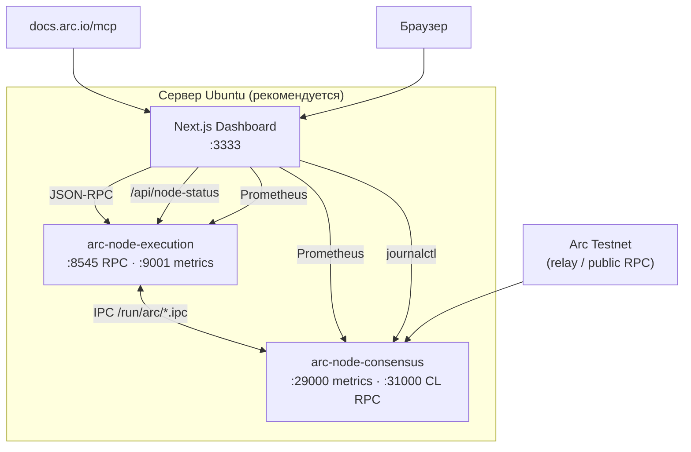

# Arc Node Runner Dashboard

> **Languages:** [English](README.md) · [한국어](README.ko.md) · [日本語](README.ja.md) · [简体中文](README.zh.md) · [Русский](README.ru.md) · [Español](README.es.md)

Веб-панель для работы с **полным узлом** Arc Testnet и мониторинга RPC, синхронизации, метрик Prometheus и системных ресурсов на одном экране.  
Интеграция с [официальным Arc Docs MCP](https://docs.arc.io/ai/mcp) (`https://docs.arc.io/mcp`) — поиск документации через **Arc Docs Assistant**.

> Архитектура узла: [Running a node](https://docs.arc.io/arc/concepts/running-a-node) · Установка: [Run an Arc node](https://docs.arc.io/arc/tutorials/run-an-arc-node) · Требования: [Node requirements](https://docs.arc.io/arc/references/node-requirements)

---

## Возможности

| Область | Описание |
|---------|----------|
| **Здоровье узла** | Опрос `eth_blockNumber`, `eth_chainId`, `eth_syncing`, `net_version` |
| **EL / CL** | Execution (Reth) и Consensus (Malachite), systemd, IPC, метрики |
| **Синхронизация** | Локальная голова vs сеть, прогресс sync |
| **Блоки / транзакции** | Недавние блоки и транзакции последнего блока (RPC) |
| **Prometheus** | EL `:9001`, CL `:29000` — прокси и графики |
| **Ресурсы** | CPU, память, диск `~/.arc` (панель и узел на **одном хосте**) |
| **Живые логи** | `journalctl` — `arc-execution` / `arc-consensus` |
| **Arc Docs (MCP)** | `search_arc_docs` — поиск в официальной документации |
| **RPC-консоль** | Прокси разрешённых JSON-RPC методов |

---

## Архитектура



**Источники данных**

- **Реальные данные**: RPC, блоки/транзакции, sync, systemd/IPC/метрики/OS (тот же хост), journal, MCP
- **Измерения/оценки**: интервал блоков, задержка RPC, прогресс головы цепи

---

## Требования

### Только панель (публичный RPC)

- **Node.js** `>= 18.18` ([Next.js 15](https://nextjs.org/))
- npm 9+

### Полный стек Ubuntu (узел + панель)

| Параметр | Рекомендация |
|----------|--------------|
| ОС | Ubuntu 22.04+ / Debian 12+ |
| CPU | Высокая частота (важнее числа ядер) |
| RAM | **64 GB+** |
| Диск | **1 TB+ NVMe** (снимки и данные цепи) |
| Сеть | Стабильные 24 Mbps+ |

Бинарник узла Arc Testnet: **v0.6.0** ([arc-node](https://github.com/circlefin/arc-node))

---

## Быстрый старт

### 1) Клонирование

```bash
git clone https://github.com/mystar777/arc-node-runner-dashboard-repository.git
cd arc-node-runner-dashboard-repository
```

### 2) Переменные окружения

```bash
cp .env.example .env.local
# при необходимости отредактируйте
```

### 3) Установка и запуск

```bash
npm install
npm run dev:local
```

Браузер: **http://127.0.0.1:3333**

> При `postinstall` устанавливаются Git-хуки, блокирующие `Co-authored-by: Cursor`. См. [Git-хуки](#блокировка-cursor-co-authored-by-в-коммитах).

---

## Ubuntu: установка узла и панели (рекомендуется)

```bash
git clone https://github.com/mystar777/arc-node-runner-dashboard-repository.git
cd arc-node-runner-dashboard-repository
sudo bash scripts/install-arc-node.sh
```

### Что делает скрипт

1. Устанавливает инструменты сборки и Rust  
2. Собирает [arc-node](https://github.com/circlefin/arc-node) `v0.6.0` → `/usr/local/bin`  
3. Создаёт `~/.arc/execution`, `~/.arc/consensus`  
4. `arc-snapshots download --chain=arc-testnet` (**1–2 часа**, большой объём)  
5. Регистрирует и запускает **systemd**  
   - `arc-execution` — RPC `127.0.0.1:8545`, metrics `:9001`  
   - `arc-consensus` — metrics `:29000`, CL RPC `:31000`  
6. `npm install` для панели и создание `.env.local`  

### Параметры установки

```bash
sudo SKIP_SNAPSHOTS=1 bash scripts/install-arc-node.sh
sudo SKIP_BUILD=1 bash scripts/install-arc-node.sh
sudo DASHBOARD_INSTALL=0 bash scripts/install-arc-node.sh
```

### Проверка синхронизации

```bash
sudo systemctl status arc-execution arc-consensus
journalctl -u arc-execution -f
cast block-number --rpc-url http://127.0.0.1:8545
```

---

## Удалённый доступ к панели

По умолчанию `npm run dev:local` слушает только **`127.0.0.1:3333`**.  
Прямой доступ по `http://YOUR_SERVER_IP:3333` **недоступен** без смены привязки.

### Вариант A — SSH-туннель (рекомендуется)

```bash
ssh -L 3333:127.0.0.1:3333 ubuntu@YOUR_SERVER_IP
```

Браузер: **http://127.0.0.1:3333**

### Вариант B — Публичный IP

```bash
npm run dev -- -H 0.0.0.0 -p 3333
sudo ufw allow 3333/tcp
```

Браузер: **http://YOUR_SERVER_IP:3333**

> При доступе из интернета обязательно используйте аутентификацию.

### Удалённый доступ и данные узла

| Где запущена панель | RPC и блоки | Метрики, диск, journal |
|---------------------|-------------|-------------------------|
| **Тот же Ubuntu, что и узел** | ✅ | ✅ |
| Другой ПК, только публичный RPC | ✅ | ❌ (предупреждение в UI) |

Метрики, `journalctl` и диск — только если **Next.js на той же машине, что и узел**.

---

## Переменные окружения

| Переменная | По умолчанию | Описание |
|------------|--------------|----------|
| `NEXT_PUBLIC_DEFAULT_RPC` | `http://127.0.0.1:8545` | RPC в браузере |
| `NEXT_PUBLIC_NETWORK_RPC` | `https://rpc.testnet.arc.network` | Сравнение с сетью |
| `ARC_RPC_URL` | `http://127.0.0.1:8545` | `/api/node-status` |
| `ARC_EXEC_METRICS_URL` | `http://127.0.0.1:9001/metrics` | EL Prometheus |
| `ARC_CONS_METRICS_URL` | `http://127.0.0.1:29000/metrics` | CL Prometheus |
| `ARC_DATA_DIR` | `/home/ubuntu/.arc` | Путь для диска |

---

## npm-скрипты

| Команда | Описание |
|---------|----------|
| `npm run dev:local` | `127.0.0.1:3333` — локально / SSH |
| `npm run setup:hooks` | Хуки против `Co-authored-by: Cursor` |
| `npm run commit:safe -- "сообщение"` | Безопасный коммит без обёртки Cursor |

---

## Arc Docs MCP

- Endpoint: `https://docs.arc.io/mcp`
- Инструменты: `search_arc_docs`, `query_docs_filesystem_arc_docs`
- Аутентификация не требуется

---

## API

| Путь | Метод | Описание |
|------|-------|----------|
| `/api/rpc` | POST | JSON-RPC прокси |
| `/api/node-status` | GET | RPC, sync, systemd, метрики, ресурсы |
| `/api/arc-mcp` | POST | Поиск в Arc Docs MCP |
| `/api/logs` | GET | `journalctl` (Linux, тот же хост) |

---

## Блокировка Cursor `Co-authored-by` в коммитах

- **Глобальные хуки**: `npm run setup:hooks`
- **Безопасный коммит**: `npm run commit:safe -- "сообщение"`

```bash
git log -1 --format=%B
```

---

## Справка Arc Testnet

| Параметр | Значение |
|----------|----------|
| Chain ID | `5042002` |
| Gas | USDC |
| Публичный RPC | `https://rpc.testnet.arc.network` |
| Explorer | [testnet.arcscan.app](https://testnet.arcscan.app/) |

| Порт | Назначение |
|------|------------|
| 8545 | Execution JSON-RPC |
| 9001 | Execution Prometheus |
| 29000 | Consensus Prometheus |
| 31000 | Consensus RPC |

---

## Устранение неполадок

- Нужен Node **18.18+** (рекомендуется **20 LTS**).
- RPC `connection refused`: `systemctl status arc-execution`, URL `http://127.0.0.1:8545`.
- Пустые метрики/логи: запускайте панель на **том же Ubuntu, что и узел**.

---

## Лицензия

См. [LICENSE](./LICENSE).

---

## Ссылки

- [Arc Network](https://docs.arc.io/arc-chain)
- [Integrate with Arc](https://docs.arc.io/integrate)
- [Arc MCP server](https://docs.arc.io/ai/mcp)
