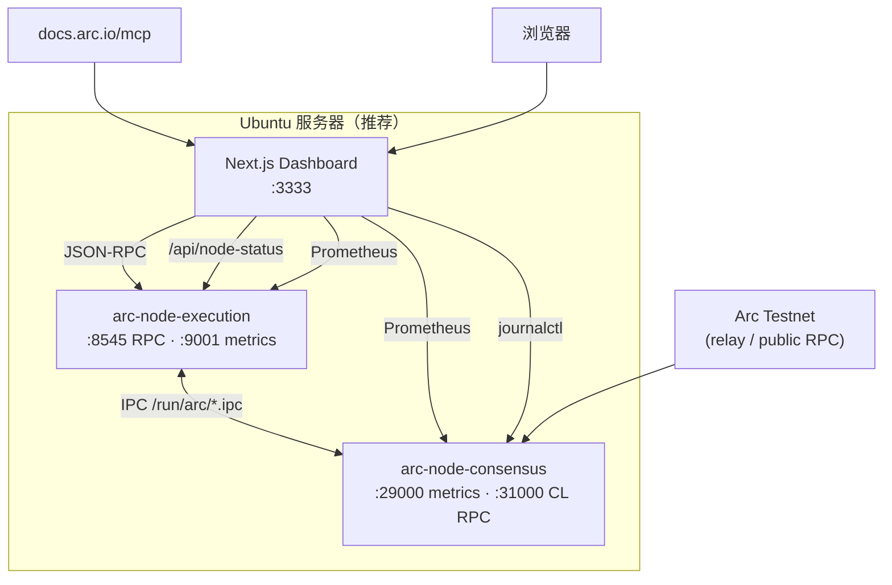

# Arc Node Runner Dashboard

> **Languages:** [English](README.md) · [한국어](README.ko.md) · [日本語](README.ja.md) · [简体中文](README.zh.md) · [Русский](README.ru.md) · [Español](README.es.md)

用于运行 Arc Testnet **全节点** 的 Web 仪表盘，在一屏内监控 RPC、同步状态、Prometheus 指标和系统资源。  
与 [Arc 官方文档 MCP](https://docs.arc.io/ai/mcp)（`https://docs.arc.io/mcp`）集成，可通过 **Arc Docs Assistant** 搜索节点运维文档。

> Arc 节点架构：[Running a node](https://docs.arc.io/arc/concepts/running-a-node) · 安装：[Run an Arc node](https://docs.arc.io/arc/tutorials/run-an-arc-node) · 要求：[Node requirements](https://docs.arc.io/arc/references/node-requirements)

---

## 主要功能

| 区域 | 说明 |
|------|------|
| **节点健康** | 轮询 `eth_blockNumber`、`eth_chainId`、`eth_syncing`、`net_version` |
| **EL / CL 状态** | Execution (Reth) 与 Consensus (Malachite)、systemd、IPC、指标 |
| **同步** | 本地头 vs 网络头、同步进度 |
| **区块 / 交易** | 最近区块与最新区块交易（链上 RPC） |
| **Prometheus** | EL `:9001`、CL `:29000` 指标代理与图表 |
| **资源** | CPU、内存、`~/.arc` 磁盘占用（仪表盘与节点 **同一主机**） |
| **实时日志** | `journalctl` — `arc-execution` / `arc-consensus` |
| **Arc Docs (MCP)** | `search_arc_docs` — 官方文档搜索 |
| **RPC 控制台** | 允许的 JSON-RPC 方法代理调用 |

---

## 架构



**数据来源**

- **实时数据**：RPC、区块/交易表、sync、systemd/IPC/指标/OS 资源（同主机）、journal 日志、MCP 搜索
- **测量/估算**：出块间隔、RPC 延迟图、链头进度图

---

## 要求

### 仅仪表盘（公共 RPC）

- **Node.js** `>= 18.18`（[Next.js 15](https://nextjs.org/)）
- npm 9+

### Ubuntu 全栈（节点 + 仪表盘）

| 项目 | 建议 |
|------|------|
| 系统 | Ubuntu 22.04+ / Debian 12+ |
| CPU | 高主频（比核心数更重要） |
| 内存 | **64 GB+** |
| 磁盘 | **1 TB+ NVMe**（快照与链数据） |
| 网络 | 稳定 24 Mbps+ |

Arc Testnet 节点二进制：**v0.6.0**（[arc-node](https://github.com/circlefin/arc-node)）

---

## 快速开始

### 1) 克隆仓库

```bash
git clone https://github.com/mystar777/arc-node-runner-dashboard-repository.git
cd arc-node-runner-dashboard-repository
```

### 2) 环境变量

```bash
cp .env.example .env.local
# 按需编辑
```

### 3) 安装依赖并运行

```bash
npm install
npm run dev:local
```

浏览器打开：**http://127.0.0.1:3333**

> `postinstall` 会安装 Git 钩子，阻止 Cursor 的 `Co-authored-by` 尾注。见 [Git 钩子](#阻止提交中的-cursor-co-authored-by)。

---

## Ubuntu：一键安装节点 + 仪表盘（推荐）

基于官方教程的自动安装脚本。

```bash
git clone https://github.com/mystar777/arc-node-runner-dashboard-repository.git
cd arc-node-runner-dashboard-repository
sudo bash scripts/install-arc-node.sh
```

### 脚本步骤

1. 安装构建工具与 Rust  
2. 构建 [arc-node](https://github.com/circlefin/arc-node) `v0.6.0` → `/usr/local/bin`  
3. 创建 `~/.arc/execution`、`~/.arc/consensus`  
4. `arc-snapshots download --chain=arc-testnet`（**1–2 小时**，大文件）  
5. 注册并启动 **systemd** 服务  
   - `arc-execution` — RPC `127.0.0.1:8545`，指标 `:9001`  
   - `arc-consensus` — 指标 `:29000`，CL RPC `:31000`  
6. 仪表盘 `npm install` 并生成 `.env.local`  

### 安装选项（环境变量）

```bash
sudo SKIP_SNAPSHOTS=1 bash scripts/install-arc-node.sh   # 跳过快照
sudo SKIP_BUILD=1 bash scripts/install-arc-node.sh       # 已编译二进制
sudo DASHBOARD_INSTALL=0 bash scripts/install-arc-node.sh # 仅跳过仪表盘
```

### 检查同步

```bash
sudo systemctl status arc-execution arc-consensus
journalctl -u arc-execution -f
cast block-number --rpc-url http://127.0.0.1:8545
```

---

## 远程查看仪表盘

默认 `npm run dev:local` 仅绑定 **`127.0.0.1:3333`**。  
无法直接访问 `http://YOUR_SERVER_IP:3333`，除非修改绑定地址。

### 方式 A — SSH 隧道（推荐）

```bash
ssh -L 3333:127.0.0.1:3333 ubuntu@YOUR_SERVER_IP
```

浏览器：**http://127.0.0.1:3333**

### 方式 B — 公网 IP 直接访问

```bash
npm run dev -- -H 0.0.0.0 -p 3333
sudo ufw allow 3333/tcp
```

浏览器：**http://YOUR_SERVER_IP:3333**

> 暴露到公网时请务必配置认证（反向代理、VPN 等）。

### 远程访问与节点数据

| 仪表盘运行位置 | RPC 与区块 | 指标、磁盘、journal |
|----------------|------------|---------------------|
| **与节点同一 Ubuntu** | ✅ | ✅ |
| 其他电脑 + 仅公共 RPC | ✅ | ❌（界面警告） |

指标（`9001`/`29000`）、`journalctl`、磁盘仅在 **Next.js 与节点同机** 时为实时数据。

---

## 环境变量

将 `.env.example` 复制为 `.env.local`。

| 变量 | 默认值 | 说明 |
|------|--------|------|
| `NEXT_PUBLIC_DEFAULT_RPC` | `http://127.0.0.1:8545` | 浏览器默认 RPC |
| `NEXT_PUBLIC_NETWORK_RPC` | `https://rpc.testnet.arc.network` | 网络头对比 |
| `ARC_RPC_URL` | `http://127.0.0.1:8545` | 服务端 `/api/node-status` |
| `ARC_EXEC_METRICS_URL` | `http://127.0.0.1:9001/metrics` | EL Prometheus |
| `ARC_CONS_METRICS_URL` | `http://127.0.0.1:29000/metrics` | CL Prometheus |
| `ARC_DATA_DIR` | `/home/ubuntu/.arc` | 磁盘用量路径 |

---

## npm 脚本

| 命令 | 说明 |
|------|------|
| `npm run dev:local` | `127.0.0.1:3333` — 本地 / SSH 隧道 |
| `npm run setup:hooks` | 安装阻止 `Co-authored-by: Cursor` 的 Git 钩子 |
| `npm run commit:safe -- "消息"` | 无 Cursor 包装的安全提交 |

---

## Arc Docs MCP

- 端点：`https://docs.arc.io/mcp`
- 工具：`search_arc_docs`、`query_docs_filesystem_arc_docs`
- 无需认证

---

## API

| 路径 | 方法 | 说明 |
|------|------|------|
| `/api/rpc` | POST | JSON-RPC 代理（仅允许 URL/方法） |
| `/api/node-status` | GET | RPC、sync、systemd、指标、资源、告警 |
| `/api/arc-mcp` | POST | Arc 文档 MCP 搜索 |
| `/api/logs` | GET | `journalctl`（Linux，同主机） |

---

## 阻止提交中的 Cursor `Co-authored-by`

- **全局钩子**：`npm run setup:hooks`
- **安全提交**：`npm run commit:safe -- "消息"`

```bash
git log -1 --format=%B
```

---

## Arc Testnet 参考

| 项目 | 值 |
|------|-----|
| Chain ID | `5042002` |
| Gas | USDC |
| 公共 RPC | `https://rpc.testnet.arc.network` |
| 浏览器 | [testnet.arcscan.app](https://testnet.arcscan.app/) |

| 端口 | 用途 |
|------|------|
| 8545 | Execution JSON-RPC |
| 9001 | Execution Prometheus |
| 29000 | Consensus Prometheus |
| 31000 | Consensus RPC |

---

## 故障排除

- 需要 Node **18.18+**（建议 **20 LTS**）。
- RPC `connection refused`：检查 `systemctl status arc-execution` 与 `http://127.0.0.1:8545`。
- 指标/日志为空：请在 **与节点相同的 Ubuntu** 上运行仪表盘。

---

## 许可证

请参阅 [LICENSE](./LICENSE)。

---

## 链接

- [Arc Network](https://docs.arc.io/arc-chain)
- [Integrate with Arc](https://docs.arc.io/integrate)
- [Arc MCP server](https://docs.arc.io/ai/mcp)
